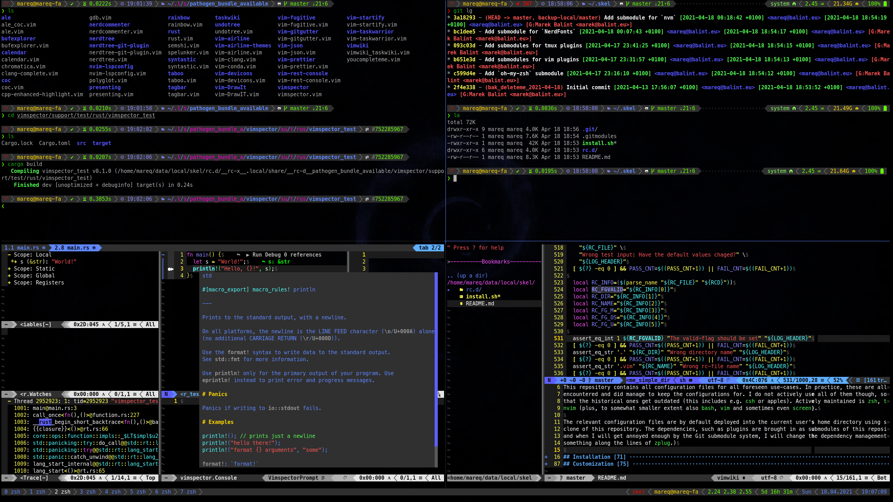

# SKEL

Named after `/etc/skel` (it is also perfectly-recursive acronym that stands for _Skel sKel skEl skeL_). The complete
self-installing environment.

This repository contains all configuration files for all foreseen use-cases. In practice, these are all use-cases I have
encountered and did manage to keep the configurations for. I do not actively use all of them though, so it may happen
that the historical ones get outdated (this includes e.g. `csh` or apples). Actively maintained is `zsh`, `tmux` and
`nvim` (plus, to somewhat smaller extent also `bash`, `vim` and sometimes even `screen`).

The relevant configuration files are by default deployed into the current user's home directory using symlinks to the
clone of this repository. The dependencies, such as plugins are brought in as submodules of this repository. (_Note_: If
and when I will get annoyed enough by the Git submodule system, I will change the dependency management to work
something along the lines of `zplug`.)



## Installation

### Prerequisites

None of these are strictly necessary, it all depends on the particular use-case. Here are some recommendations:

- _old-school_
  ```
  apt install bash screen vim
  ```

- _new fancy alternatives_
  ```
  apt install zsh zplug tmux nvim
  ```

- _taskwiki_ vim-plugin
  ```
  apt install taskwarrior python3-tasklib
  ```

_Note_: While not strictly necessary (it is indeed possible to e.g. send `tar.gz` around instead), it is somewhat recommended to
have `git` installed.
```
apt install git
```

### Default Installation Method

The fast default way of installing:
- Clone this repository (`$HOME/.skel` is an example, any path will do, just keep in mind that it is going to stay
  there).
  ```
  git clone https://github.com/mareq/skel.git ${HOME}/.skel
  cd ${HOME}/.skel
  ```
- **UPDATE SUBMODULES**: All dependencies are kept in separate submodules. Not having the submodules correctly updated
  will result problems - resolve those by updating submodules.
  ```
  git submodule update --init
  ```
- Run the installation script.
  ```
  ./install.sh
  ```
- **DO WATCH FOR ERRORS**: The installation script tries to behave nicely and it does *NOT* create new directories. This
  means that if it needs to put something to a path that does not exist, it will print error message instead. Create the
  missing directories and re-run the installation script.
  ```
  mkdir -p ${HOME}/the/missing/directory
  ./install.sh
  ```

### Custom Installation Method

The installation script takes heed of the following environment variables (_Note_: If and when I will get annoyed enough
by having to type out the environment variables, I will add also corresponding command-line arguments, and while I will
be at it, I may even add `--help`).

- `DRY_RUN`: If set to non-empty string, the installation scipt will not perform actual installation actions.
- `PREFIX`: Installation prefix. Default value: `$HOME`
- `DATA_DIR`: The root of the directory tree with the configuration scripts to be deployed. These will become targets of
  the symlinks created during the installation. Default value: `<path-to-install.sh>/rc.d/`
- `BAK_EXT`: Extension to be appended to pre-existent files that are being replaced by the installation. Default value:
  `.skel-<YYYY-DD-MM>-backup`
- `FLAG_OS`: Operating system flag. Allows installation of OS-specific files for given operating system. Allowed values:
  `lx` for Linux, `mac` for apples; Default value: `<current-os>`
- `FLAG_USER`: User-kind flag. Allows installation of user-specific files for given kind of user. Allowed values: `user`
  for normal user, `root` for superuser; Default value: `<current-user-kind>`


## Customization

The final effect of running the installation script can be customized by modifying the contents of the `$DATA_DIR`. The
environment variable can be used to pass the path of user-specific `$DATA_DIR`. This can be done in combination with the
original contents of this repository, so that both `$DATA_DIR`s get deployed. Such approach is ideal for deploying
custom private contents such as keys and password-stores, which need to be kept separately on local hard drive and can
not be pushed to (public) repository.

### Data Directory Structure

The deployed configuration files are determined by the contents of the `$DATA_DIR`. The installation script recursively
traverses the `$DATA_DIR` and conditionally deploys files and directories matching the predefined name patterns.
Non-matching files are ignored and non-matching directories are recursively traversed.

For a file/directory to be matched, its name shall be constructed using the following grammar:
```
matched_name = matched_file | matched_dir ;

matched_file = "__rc-f", flags, "__", file_name ;
matched_dir = "__rc-d", flags, "__", dir_name ;

flags = | flags, "_", flag ;
flag = method_flag | os_flag | user_flag ;

method_flag = "m-", method ;
method = "ln" | "hl" | "cp" ;

os_flag = "u-", os ;
os = "lx" | "mac" ;

user_flag = "u-", user ;
user = "user" | "root" ;
```

The `<file_name>`/`<dir_name>` of the file/directory, together with its path relative to the `$DATA_DIR` determine the name
and its deployment path relative to `$PREFIX`.

The `<flags>` dictate if and how it will be deployed.  The file/directory will be deployed iff its `<os>` and `<user>`
match the current use-case. The files/directories without explicit specification of these values will be deployed under
all use-cases.

The file/directory will be deployed using `<method>`:
- `ln`: Symlink from `$DATA_DIR` to the deployment path. This is the default and preferred method.
- `hl`: Hardlink from `$DATA_DIR` to the deployment path. 
- `cp`: Copy from `$DATA_DIR` to the deployment path.

There are several reasons for symlinking being the preferred method:
- Symlinks are the most straight-forward way to reliably persist information about the deployment itself, so that
repeated calls to the install script can skip over already deployed files instead of keeping to replace them by
themselves, while cluttering the file system with numerous backups in the proces.
- All edits to the live configuration is automatically visible in the source working copy, which makes it very easy to
  manage the changes.
- Unlike hardlinks, symlinks work also accross file system boundaries and for directories.
- Unlike links, copying does the deep-copy, which may take a lot of time and disk-space (although size of the whole
  repository should arguably be negligible, this may be less true when the submodules are counted in as well).

On top of the above described grammar, any directory with the name prefixed with `"__rc-x__"` will be traversed (*NOT*
deployed) as any other old directory, but it will contribute only its name after this prefix to the eventual deployment
path of its contents. This has been introduced as convenience feature allowing for "un-hiding" hidden directories
(starting with dot): e.g. directory `__rc-x__.config` will behave exactly as if it was named `.config`, except it will
not be hidden when running `ls` inside the `$DATA_DIR`.

### Examples

Following are a few examples of how will be files in the `$DATA_DIR` deployed into the `$PREFIX`:

| `$DATA_DIR`                                                     | `$PREFIX`                      | **Method**                           | **Condition**              |
| --------------------------------------------------------------- | ------------------------------ | ------------------------------------ | ------------------------   |
| `./foorc`                                                       | N/A                            | ignored                              | always                     |
| `./__rc-f__.foorc`                                              | `./foorc`                      | symlink                              | always                     |
| `./.local/share/fonts/__rc-f_m-hl_u-user_os-lx_foo.ttf`         | `./.local/share/fonts/foo.ttf` | hardlink                             | only normal users on Linux |
| `./__rx-x__.local/share/__rc-d_u-user__foo/`                    | `./.local/share/foo/`          | symlink                              | only normal users          |
| `./__rx-x__.local/share/__rc-d_foo/bar/baz/qux`                 | N/A                            | indirectly: `foo/` will be symlinked | allways                    |


